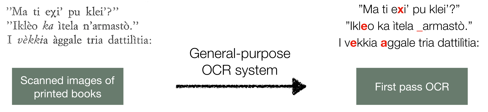
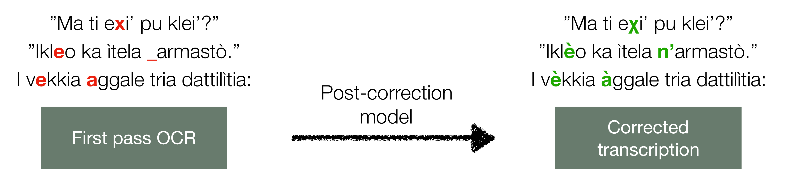

<!---
:pushpin: **Coming soon:** an update to the software including features from our paper on semi-supervised OCR post-correction, to be published in the Transactions of the Association for Computational Linguistics (TACL)! 

Check out the paper [here](https://arxiv.org/abs/2111.02622v1).

New features coming soon:
* A module for self-training the OCR post-correction model
* A module for joint decoding with the neural model and a count-based language model using weighted finite state automata (WFSA)
-->

# OCR Post Correction for Endangered Language Texts

This repository contains code for models and experiments from the paper "[OCR Post Correction for Endangered Language Texts](https://www.aclweb.org/anthology/2020.emnlp-main.478/)".

Textual data in endangered languages is often found in **formats that are not machine-readable**, including scanned images of paper books. Extracting the text is challenging because there is typically **no annotated data to train an OCR system** for each endangered language. Instead, we focus on post-correcting the OCR output from a general-purpose OCR system. 

:pushpin: In the paper, we present a dataset containing annotations for documents in three critically endangered languages: Ainu, Griko, Yakkha. 

:pushpin: Our model reduces the recognition error rate by 34% on average, over a state-of-the-art OCR system.

Learn more about the paper [here](https://shrutirij.github.io/ocr-el/)!


## OCR Post-Correction 
The goal of OCR post-correction is to automatically correct errors in the text output from an existing OCR system.

The existing OCR system is used to obtain a *first pass transcription* of the input image (example below in the endangered language Griko):

<div align="center"></div>


The incorrectly recognized characters in the *first pass* are then corrected by the post-correction model.

<div align="center"></div>

## Model

As seen in the example above, OCR post-correction is a text-based sequence-to-sequence task. 

:pushpin: We use a **character-level encoder-decoder architecture with attention** and add several adaptations for the low-resource setting. The paper has all the details!

:pushpin: The model is trained in a **supervised** manner. The training data consists of first pass OCR outputs as the *source* with corresponding manually corrected transcriptions as the *target*.

:pushpin: Some books that contain texts in endangered languages also contain translations of the text in another (usually high-resource) language. We incorporate an additional encoder in the model, with a **multisource** framework, to use the information from these translations if they are available.

We provide instructions for both single-source and multisource models:

- The **single-source** model can be used for almost any document and is significantly easier to set up.

- The **multisource** model can only be used if translations are available.

## Dataset

This repository contains a sample from our dataset in `sample_dataset`, which you can use to train the post-correction model. Get the full dataset [here](https://forms.office.com/Pages/ResponsePage.aspx?id=DQSIkWdsW0yxEjajBLZtrQAAAAAAAAAAAAN__tAC8ehURVRVMVdQQjQzWlBSMkNaOEJKTUpWVFlEQy4u)!

However, this repository can be used to train OCR post-correction models for **documents in any language**!

:rocket: If you want to use our model with a new set of documents, construct a dataset by following the steps [here](firstpass.md).

:rocket: We'd love to hear about the new datasets and models you build: send us an email at [srijhwan@cs.cmu.edu](mailto:srijhwan@cs.cmu.edu)!


## Running Experiments
Once you have a suitable dataset (e.g., `sample_dataset` or your own dataset), you can train a model and run experiments on OCR post-correction. 

If you have your own dataset, you can use the `utils/prepare_data.py` script to create train, development, and test splits (see the last step [here](firstpass.md)).

The steps are described below, illustrated with `sample_dataset/postcorrection`. If using another dataset, simply change the experiment settings to point to your dataset and run the same scripts.

### Requirements
Python 3+ is required. Pip can be used to install the packages:

```
pip install -r postcorr_requirements.txt
```

### Training

The process of training the post-correction model has two main steps:

* Pretraining with first pass OCR outputs.
* Training with manually corrected transcriptions in a supervised manner.

For a single-source model, modify the experimental settings in `train_single-source.sh` to point to the appropriate dataset and desired output folder. It is currently set up to use `sample_dataset`.

Then run
```
bash train_single-source.sh
```

For multisource, use `train_multi-source.sh`.

Log files and saved models are written to the user-specified experiment folder for both the pretraining and training steps. For a list of all available hyperparameters and options, look at `postcorrection/constants.py` and `postcorrection/opts.py`.


### Testing

For testing with a single-source model, modify the experimental settings in `test_single-source.sh`. It is currently set up to use `sample_dataset`.

Then run
```
bash test_single-source.sh
```

For multisource, use `test_multi-source.sh`.


## Citation
Please cite our paper if this repository was useful.
```
@inproceedings{rijhwani-etal-2020-ocr,
    title = "{OCR} {P}ost {C}orrection for {E}ndangered {L}anguage {T}exts",
    author = "Rijhwani, Shruti  and
      Anastasopoulos, Antonios  and
      Neubig, Graham",
    booktitle = "Proceedings of the 2020 Conference on Empirical Methods in Natural Language Processing (EMNLP)",
    month = nov,
    year = "2020",
    address = "Online",
    publisher = "Association for Computational Linguistics",
    url = "https://www.aclweb.org/anthology/2020.emnlp-main.478",
    doi = "10.18653/v1/2020.emnlp-main.478",
    pages = "5931--5942",
}
```

## License
* [Software License](./LICENSE)
* [Dataset License](sample_dataset/LICENSE)
