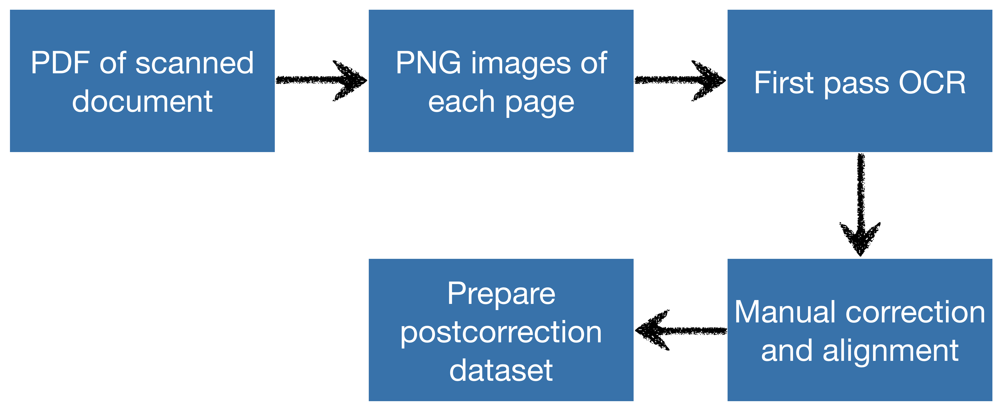

# Post-Correction Dataset Creation

This document describes the instructions to obtain **first pass OCR** on a scanned document and using it to **create a dataset for OCR post-correction**. 

The process begins with a PDF or images (PNG, JPEG etc.) of each page in the scanned document, for which we get the first pass OCR from an existing system. A small subset of the pages need to be *manually corrected* to form the training data for the post-correction model. The trained model can then be applied to all the uncorrected pages for automatic OCR post-correction.

<div align="center"></div>

## Requirements

Python 3+ is required. Pip can be used to install the packages:

```
pip install -r ocr_requirements.txt
```

If the scanned document is in the form of a PDF, `poppler` is required to convert the PDF to image files. Follow the "how to install" instructions [here](https://github.com/Belval/pdf2image/blob/master/README.md).


## First Pass OCR

As described in the [main document](README.md), some books that contain endangered language texts also contain a translation in another language. If the document contains such a translation, we call it **multisource**. If not, it is **single-source**.

We demonstrate all steps of the process with a sample multisource document that contains text in the endangered language Griko with its translation in Italian. We start with a [PDF of the document](sample_dataset/images/pdf/griko.pdf).

Some of the steps are likely not necessary for setting up a dataset with a single-source document. 

Since using a single-source document **is easier**, we recommend starting off with this setting. Even if the document is multisource, the portions with the translation can simply be skipped during processing. 

### Convert PDF to image

The first step is converting the PDF into a set of images, one per page.

```
python firstpass_ocr/pdf_to_png.py  \
--pdf sample_dataset/images/pdf/griko.pdf  \
--output_folder sample_dataset/images/png
```

### Crop images

This step is likely not necessary for a **single-source** document.

For a **multisource** document, the translation may be present on the same page as the endangered language text. This can be in various different layouts, such as a two column format or interleaved pages.

We recommend using a layout analysis tool such as [LAREX](https://github.com/OCR4all/LAREX) for complex layouts.

In our case, each page in the PDF contains Griko text on the left and its Italian translation on the right. This is a relatively simple layout to crop: we cut each page's image into two halves down the middle. This is easily done with a tool like [image_slicer](https://github.com/samdobson/image_slicer). 

The sample cropped images are [here](/sample_dataset/images/cropped_pngs).

### Obtaining OCR output

We use the existing OCR system from [Google Vision](https://cloud.google.com/vision/) to obtain the first pass OCR.

The steps to use the API are:
- Sign up for [Google Cloud](https://cloud.google.com/).
- Go to the [Console](https://console.cloud.google.com/home) and create a new project at the top left corner.
- [Enable the Vision API](https://console.cloud.google.com/apis/library/vision.googleapis.com) for the project.
- You will then be redirected to a page with a button to "Create Credentials".
    - When creating the credential, choose "Cloud Vision API" and "No, I’m not using them".
    - In the next step, choose any service name you want and "Project --> Owner" as the role.
    - A JSON file will be generated with your credentials.

The first 1000 images processed *per month* with Google Cloud are free. The platform also offers a $300 credit to new users.

If you are unable to sign up for Google Cloud, please email us at srijhwan@cs.cmu.edu and we might be able to help!

Given your credentials json file, run the following commands to get the first pass OCR:

```
export GOOGLE_APPLICATION_CREDENTIALS=[credentials.json]

python firstpass_ocr/transcribe_image.py  \
--image_folder sample_dataset/images/cropped_pngs  \
--output_folder sample_dataset/images/ocr_output
```

## Constructing a Post-Correction Dataset
